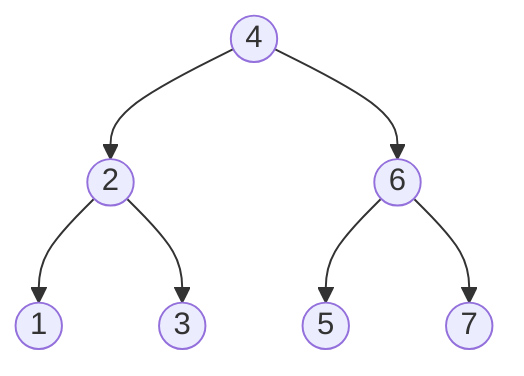
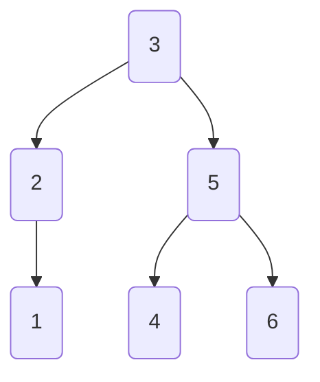
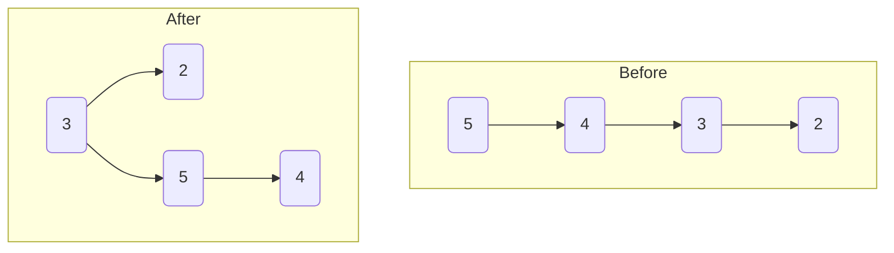

# 树结构

## 一、二叉搜索树

二叉搜索树（BST）满足以下结构特性：

- 任意节点的左子树非空时，其所有节点值均小于根节点值；
- 任意节点的右子树非空时，其所有节点值均大于根节点值；
- 该性质递归适用于每个节点的左右子树。

在标准 BST 中，查询时间复杂度与目标节点的深度正相关。当树结构退化为链式结构时，最坏情况时间复杂度将上升至 O(n)。

为解决该效率问题，衍生出平衡二叉搜索树结构，其通过动态调整维持近似平衡的树形结构（各子树高度差受限），从而确保查询、插入、删除等操作的最坏时间复杂度稳定在 O(log n)。

这种平衡机制通过旋转、重构等操作实现，典型实现包括 AVL 树、红黑树等。

## 二、平衡二叉搜索树

自平衡二叉搜索树在符合二叉搜索树的条件下，所有叶子的深度趋于平衡。

**AVL 平衡树**：

**旋转操作示例（右旋）**：

- 当节点 `3` 的平衡因子变为 2（左子树高度 - 右子树高度 ≥ 2）
- 以节点 `3` 为中心进行右旋重构

## 三、多路平衡查找树

### B 树

磁盘数据读取以**磁盘块**为基本单位，单次读取会加载整个块的数据。

B-tree 通过组织数据结构，使每个磁盘块中的键值能高效定位目标记录，从而减少磁盘 I/O 次数。

- **数据记录结构**

  每条记录表示为二元组 `[key, data]`。

  - `key`：唯一标识记录的主键（Primary Key）
  - `data`：主键外其他字段的数据

- **m 阶 B 树性质**（m ≥ 3）
  
  - 树形数据结构满足
    - 节点最大分支数：`m`
    - 所有叶节点共层级
  - 节点分支约束
    - 根节点：非叶节点时分支数 ≥ 2
    - 内部节点（非根）：分支数 ∈ [⌈m/2⌉, m]

- **键值数量规则**

  对于含 `k` 个子节点的非叶节点：
  
  - 必存储 `k-1` 个升序排列的主键
  - 键值序列建立区间映射关系，指导子树搜索路径

B-tree 中的每个节点通过动态维护键值数量与子节点指针，实现存储空间利用率与查询效率的平衡。

典型 3 阶 B 树中，非根内部节点分支数稳定在 2 - 3 区间。

B-tree 节点采用磁盘块存储结构，每个节点包含两个按升序排列的键值（Key）和三个子树指针（Pointer）。

其中，指针指向子节点所在的磁盘块物理地址，键值通过三元划分（k₁ < 范围 ≤ k₂）严格界定子树数据域：

以根节点键值 `17` 和 `35` 为例，P1 子树数据域为 `<17`，P2 子树数据域为 `[17,35]`，P3 子树数据域为 `>35`。

相较于 AVL 树，B 树通过层级压缩显著降低节点总数，使单次磁盘 I/O 加载的节点数据得到充分利用，有效提升大规模数据查询性能。

### B+ 树

B+ 树是针对 B 树优化的外存索引结构（如 InnoDB 引擎标准实现），其核心改进在于存储分离与顺序访问优化：

- **存储架构重构**
  - B 树节点同时存储键值（Key）与数据（Data），受限于页存储容量，导致扇出率（Fan-out）低下，数据量激增时树深度呈线性增长，I/O 复杂度升至 O(h)
  - B+ 树实施严格层级分工：非叶节点仅存键值索引，叶节点全量存储数据记录并通过双向链表串联，使非叶节点扇出率提升 4 - 10 倍（单页键值容量从 4 增至 40）
- **性能优势量化**
  - 树高度对数级压缩（如千万级数据下 B+ 树高度 3 - 4 vs B 树高度 8 - 10）
  - 范围查询时间复杂度从 O(h + n) 优化至 O(log n + k)，链表结构实现顺序访问免回溯

优化 B-tree 为 B+ tree 结构，其中非叶子节点仅存储键值及指针，假设每个磁盘块可容纳 4 个键值及指针，其优化后的结构如下图所示。

B+ 树索引在数据库中的实现具有以下技术特性：

- **双指针体系与查询模式**
  
  - 采用根节点指针和最小叶节点指针的双向定位机制
  - 叶节点层通过双向链表构建有序环状结构
  - 支持两种检索方式：基于叶链的范围/分页扫描，以及根起始的随机精确检索
- **存储结构与容量计算**
  - InnoDB 引擎页容量为 16 KB，按主键类型（INT = 4B / BIGINT = 8B）及指针（4 - 8B）计算
  - 单页存储密度：16 KB / (8B 键值 + 8B 指针) ≈ 1K 索引项
  - 三级树型结构理论存储量：10^3 × 10^3 × 10^3 = 10 亿记录

- **索引架构设计**

  | 索引类型 | 存储结构             | 数据关联机制                             |
  | -------- | -------------------- | ---------------------------------------- |
  | 聚集索引 | 叶节点直接驻留数据页 | 主键与行记录物理存储一致                 |
  | 辅助索引 | 叶节点存储主键引用   | 二次查询机制：辅助索引 → 主键 → 聚集索引 |

