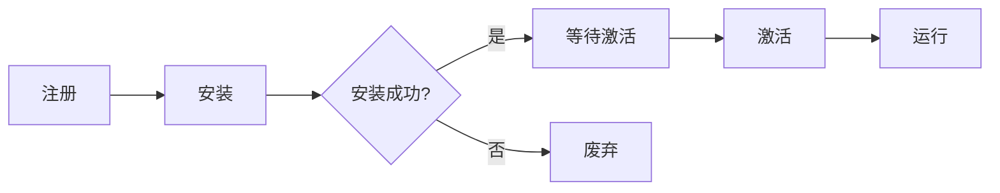

# Service Worker

[Service Worker](https://www.w3.org/TR/service-workers/) 是运行于浏览器后台的代理脚本，通过拦截并管理网络请求实现离线资源缓存与动态请求处理。

**功能定位如下**：

- 浏览器**网络代理**：拦截和处理网络请求
- **独立线程**运行：不阻塞主线程
- **离线优先**策略：实现可靠的离线体验
- **可编程缓存**：精确控制资源缓存

## 一、生命周期管理



### 注册阶段

在应用程序的主 JavaScript 文件（如 `app.js`）中，通过调用 [`ServiceWorkerContainer.register()`](https://developer.mozilla.org/zh-CN/docs/Web/API/ServiceWorkerContainer/register) 方法实现 [Service Worker](https://developer.mozilla.org/zh-CN/docs/Web/API/Service_Worker_API/Using_Service_Workers#%E6%B3%A8%E5%86%8C%E4%BD%A0%E7%9A%84_worker) 的注册，该初始代码段作为 Service Worker 功能的入口点，是其核心实现方式。

```javascript
// 最佳实践：页面加载完成后注册
window.addEventListener('load', () => {
  if ('serviceWorker' in navigator) {
    navigator.serviceWorker.register('/sw.js', {
      scope: '/app/',         // 控制作用域
      updateViaCache: 'none'  // 禁用HTTP缓存
    }).then(registration => {
      console.log('Registration succeeded:', registration);
    });
  }
});
```

### 安装阶段

Service Worker 完成注册后，浏览器会在后台启动安装流程。

安装阶段会触发 [`install`](https://developer.mozilla.org/en-US/docs/Web/API/ServiceWorkerGlobalScope/install_event) 事件，开发者通常在此阶段通过 Service Worker 专属的 [`Cache`](https://developer.mozilla.org/zh-CN/docs/Web/API/Cache) 存储 API 缓存核心静态资源以实现离线可用性。该 API 通过请求对象作为键值对网络响应进行持久化存储，其[作用域](https://w3c.github.io/ServiceWorker/#dom-registrationoptions-scope)限定于当前域且不受浏览器默认缓存策略影响。

安装结果分为两种状态：

- **成功**：所有指定资源完成缓存后进入 [Activated](https://www.w3.org/TR/service-workers/#dom-serviceworkerstate-activated) 状态；
- [**失败**](https://developer.mozilla.org/zh-CN/docs/Web/API/Service_Worker_API/Using_Service_Workers#%E4%B8%BA%E4%BB%80%E4%B9%88%E6%88%91%E7%9A%84_service_worker_%E6%B3%A8%E5%86%8C%E5%A4%B1%E8%B4%A5%E4%BA%86%EF%BC%9F)：任一资源缓存失败则终止安装，Service Worker 转入 Error 状态等待后续重试。

缓存内容将永久驻留直至显式调用清除方法，此机制为 Web 应用提供可靠的离线资源管理能力。

```javascript
self.addEventListener('install', event => {
  // 初始化缓存
  event.waitUntil(
    caches.open('static-v1').then(cache => 
      cache.addAll([
        '/app/',
        '/app/styles.css',
        '/app/main.js'
      ])
    )
  );
});
```

### 激活阶段

Service Worker 完成安装后即进入激活阶段。首次安装或激活周期仅完成工作线程注册，此时不会触发资源控制权接管。

核心应用场景差异体现在更新场景中：当检测到新版本 Service Worker 文件时，浏览器会自动触发更新流程，此时激活阶段将执行旧版本资源回收与新版本控制权接管操作。

```javascript
self.addEventListener('activate', event => {
  console.log('V1 now ready to handle fetches!');
});
```

### 运行

成功缓存站点资源后，需通过注册 [`fetch`](https://developer.mozilla.org/en-US/docs/Web/API/ServiceWorkerGlobalScope/fetch_event) 事件监听器实现缓存资源调度。该事件在浏览器发起网络请求时触发，开发者可通过 [`event.respondWith()`](https://developer.mozilla.org/zh-CN/docs/Web/API/FetchEvent/respondWith) 方法注入缓存响应逻辑，具体实现需在 Service Worker 脚本中完成请求拦截与缓存匹配机制。

```javascript
self.addEventListener('fetch', event => {
  const url = new URL(event.request.url);

  if (url.origin == location.origin && url.pathname == '/dog.svg') {
    event.respondWith(caches.match('/cat.svg'));
  }
});
```

### 更新

Service Worker 版本更新遵循浏览器端生命周期管控机制：当检测到新版本时，后台完成安装后进入待激活状态，此时旧版本仍保持控制权；新版本需在所有关联页面终止对旧实例的引用并满足激活条件后，方可自动激活并接管控制权。

Service Worker 的全局方法 [`skipWaiting()`](https://developer.mozilla.org/zh-CN/docs/Web/API/ServiceWorkerGlobalScope/skipWaiting) 可在检测到新版本时立即激活更新，绕过默认的等待阶段实现快速版本切换，并自动接管当前页面及所有受控客户端的控制权。

```javascript
self.addEventListener('install', event => {
  // 跳过等待直接激活
  self.skipWaiting();
  
  // 新版本缓存
  event.waitUntil(
    caches.open('static-v2').then(cache => 
      cache.addAll([
        '/app/',
        '/app/styles.css',
        '/app/main.js'
      ])
    )
  );
});
```

在用户首次访问时，Service Worker 安装并激活后，不会立即接管现有页面控制权，需页面刷新后生效。该机制影响范围包含所有现有同源客户端页面，包括首次注册 Service Worker 的页面及其他未受控的同源标签页。

可以通过使用 [`clients.claim()`](https://developer.mozilla.org/zh-CN/docs/Web/API/Clients/claim) 立即接管所有未被控制的同源客户端，实现无需刷新页面的全域控制权同步，使得后续请求能通过 Service Worker 处理。

```javascript
self.addEventListener('activate', event => {
  // 立即接管控制权
  event.waitUntil(self.clients.claim());
});
```

浏览器会在以下时机自动检查 `sw.js` 是否更新：

- **页面导航事件**（如跳转、刷新）。
- **每隔 24 小时**（后台定期轮询，即使页面未刷新）。
- **手动触发更新**（通过 [`registration.update()`](https://developer.mozilla.org/zh-CN/docs/Web/API/ServiceWorkerRegistration/update)）。

在代码中手动触发更新，通常做法如下代码所示（主线程执行）。

```javascript
navigator.serviceWorker.register('/sw.js')
  .then(reg => reg.update());
```

可以使用 [`activate`](https://developer.mozilla.org/en-US/docs/Web/API/ServiceWorkerGlobalScope/activate_event) 事件从之前的缓存中[移除数据](https://developer.mozilla.org/zh-CN/docs/Web/API/Service_Worker_API/Using_Service_Workers#%E5%88%A0%E9%99%A4%E6%97%A7%E7%BC%93%E5%AD%98)。

## 二、核心 API

| 接口对象                                                     | 核心能力       | 典型应用场景 |
| ------------------------------------------------------------ | -------------- | ------------ |
| [**CacheStorage**](https://developer.mozilla.org/zh-CN/docs/Web/API/CacheStorage) | 管理缓存数据库 | 离线资源存储 |
| [**FetchEvent**](https://developer.mozilla.org/zh-CN/docs/Web/API/FetchEvent) | 请求拦截处理   | 动态资源响应 |
| [**Client**](https://developer.mozilla.org/zh-CN/docs/Web/API/Client) | 控制关联页面   | 跨窗口通信   |
| [**Notification**](https://developer.mozilla.org/zh-CN/docs/Web/API/Notification) | 系统通知管理   | 推送消息展示 |

### FetchEvent

通过 [`FetchEvent`](https://developer.mozilla.org/zh-CN/docs/Web/API/FetchEvent) 可以自定义请求的响应。

```javascript
self.addEventListener('fetch', event => {
  const request = event.request;
  
  // 缓存优先策略
  event.respondWith(
    caches.match(request).then(cached => 
      cached || fetch(request).then(response => {
        // 动态缓存非API请求
        if (!request.url.includes('/api/')) {
          const clone = response.clone();
          caches.open('dynamic-v1').then(cache => 
            cache.put(request, clone)
          );
        }
        return response;
      })
    )
  );
});
```

**实例属性**：

- event.[**request**](https://developer.mozilla.org/zh-CN/docs/Web/API/FetchEvent/request)

  当前请求对象。

**实例方法**：

- event.[**respondWith**](https://developer.mozilla.org/zh-CN/docs/Web/API/FetchEvent/respondWith)(*response*)

  阻止浏览器默认的 `fetch` 操作。

## 三、缓存策略

| 策略名称                   | 实现方式                   | 适用场景       | 优缺点分析       |
| -------------------------- | -------------------------- | -------------- | ---------------- |
| **Cache First**            | 优先返回缓存，无缓存再请求 | 静态资源       | 快速但可能陈旧   |
| **Network First**          | 先请求网络，失败用缓存     | 实时性要求高   | 可靠但延迟较高   |
| **Stale While Revalidate** | 同时返回缓存并更新缓存     | 可接受短暂陈旧 | 平衡速度与新鲜度 |

## Reference

- [jakearchibald/cat.svg](https://gist.github.com/jakearchibald/80368b84ac1ae8e229fc90b3fe826301)
  - [RawGit](https://gists.rawgit.com/jakearchibald/80368b84ac1ae8e229fc90b3fe826301/raw/c891abf8ee55b1a65cc433711d047c899409d0ef/)
- [Service Work - *iT 邦幫忙*](https://ithelp.ithome.com.tw/m/articles/10187529)
- [Service Worker 生命周期](https://developers.google.com/web/fundamentals/instant-and-offline/service-worker/lifecycle)
- [Service Worker 工作原理](https://lavas-project.github.io/pwa-book/chapter04/3-service-worker-dive.html)
- [Service Worker 之 `clients.claim()` vs `skipWaiting()`](https://tomwang1013.github.io/pwa-clients-claim-vs-self-skipWaiting/)

